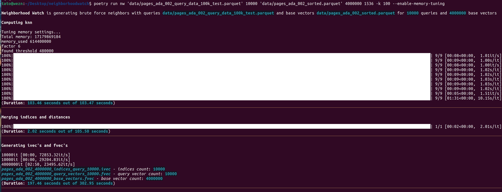
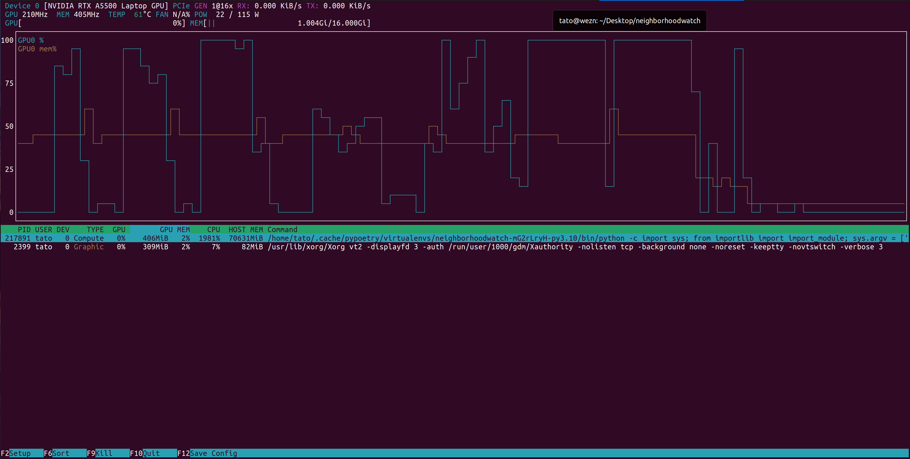

## NeighborhoodWatch

NeighborhoodWatch (`nw`) is a GPU powered brute force knn ground truth dataset generator

### Set Up the Environment

At high level, in order to run this program, the following prerqusites need to be satsified:
* One computing instance with Nividia GPU (e.g. AWS `p3.8xlarge` instance type)
* Nivdia CUDA toolkit and driver 12 installed ([link](https://docs.nvidia.com/cuda/cuda-installation-guide-linux/index.html))
* Nividia cuDNN library installed ([link](https://docs.nvidia.com/deeplearning/cudnn/install-guide/index.html))
* Nividia NCCL library installed ([link](https://docs.nvidia.com/deeplearning/nccl/install-guide/index.html))
* Python version 3.10
   * A python virtual environemtn (e.g. MiniConda) is highly recommended
* Poetry Python dependency management

An example of setting up a bare-metal environment on an AWS `p3.8xlarge` instance with `Ubuntun 22.04` OS is provided in the following script:
* [install_baremetal_env.sh](bash/install_baremetal_env.sh)

For convenience purposes, a [Dockerfile](./Dockerfile) is also provided which allows you to build a docker image allows you to run the `nw` program within a docker container with all the required driver and library dependencies. For more detailed information, please refer to the [nw_docker](./nw_docker.md) document

---

### Run the Program

First check and install Python dependencies by running the following commands in the home directory of this program:

```
poetry lock && poetry install
```

Then run the program with `poetry run nw <input parameter list>` command. The available input parameter list is as below:
```
$ poetry run nw -h
usage: nw [-h] [-m MODEL_NAME] [-rd REDUCED_DIMENSION_SIZE] [-k K] [--data_dir DATA_DIR] [--skip-zero-vec | --no-skip-zero-vec] [--use-dataset-api | --no-use-dataset-api] [--gen-hdf5 | --no-gen-hdf5]
          [--post-validation | --no-post-validation] [--enable-memory-tuning] [--disable-memory-tuning]
          query_count base_count

nw (neighborhood watch) uses GPU acceleration to generate ground truth KNN datasets

positional arguments:
  query_count           number of query vectors to generate
  base_count            number of base vectors to generate

options:
  -h, --help            show this help message and exit
  -m MODEL_NAME, --model_name MODEL_NAME
                        model name to use for generating embeddings, i.e. text-embedding-ada-002, textembedding-gecko, or intfloat/e5-large-v2
  -rd REDUCED_DIMENSION_SIZE, --reduced_dimension_size REDUCED_DIMENSION_SIZE
                        Reduced (output) dimension size. Only supported in models (e.g. OpenAI text-embedding-3-xxx) that have this feature. Ignored otherwise!
  -k K, --k K           number of neighbors to compute per query vector
  --data_dir DATA_DIR   Directory to store the generated data (default: knn_dataset)
  --skip-zero-vec, --no-skip-zero-vec
                        Skip generating zero vectors when failing to retrieve the embedding (default: True) (default: True)
  --use-dataset-api, --no-use-dataset-api
                        Use 'pyarrow.dataset' API to read the dataset (default: True). Recommended for large datasets. (default: False)
  --gen-hdf5, --no-gen-hdf5
                        Generate hdf5 files (default: True) (default: True)
  --post-validation, --no-post-validation
                        Validate the generated files (default: False) (default: False)
  --enable-memory-tuning
                        Enable memory tuning
  --disable-memory-tuning
                        Disable memory tuning (useful for very small datasets)

Some example commands:

    nw 1000 10000 -k 100 -m 'textembedding-gecko' --disable-memory-tuning
    nw 1000 10000 -k 100 -m 'intfloat/e5-large-v2' --disable-memory-tuning
    nw 1000 10000 -k 100 -m 'intfloat/e5-small-v2' --disable-memory-tuning
    nw 1000 10000 -k 100 -m 'intfloat/e5-base-v2' --disable-memory-tuning
```

### Generated Datasets

After the program is successfully run, it will generate a set of data sets under a spcified folder which is default to `knn_dataset` subfolder. 
You can override the output directory using the `--data_dir <dir_name>` option.

In particular, the following datasets include the KNN ground truth results:
| file format | dataset name | dataset file | 
| ----------- | ------------ | ------------ | 
| `fvec` | `train` dataset (base) | `<model_name>_<base_count>_base_vectors` |
| `fvec` | `test` dataset (query)| `<model_name>_<base_count>_query_vectors_<query_count>` |
| `fvec` | `distances` dataset (distances) | `<model_name>_<base_count>_distances_<query_count>` |
| `ivec` | `neighors` dataset (indices) | `<model_name>_<base_count>_indices_query_<query_count>` |
| `hdf5` | consolidated hdf5 dataset of the above 4 datasets | `<model_name>_base_<base_count>_query_<query_count>` |


### Run the Tests

```
poetry run pytest
```

#### cli:



#### nvtop:


